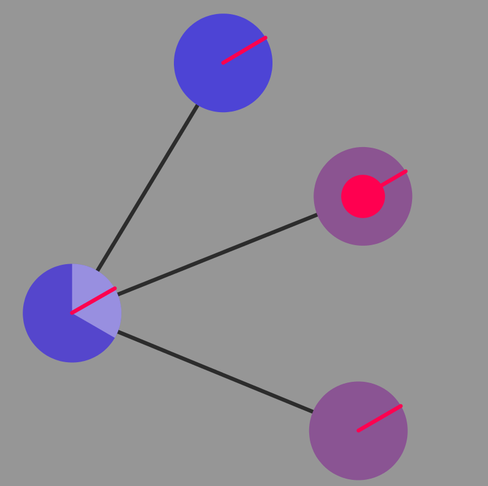
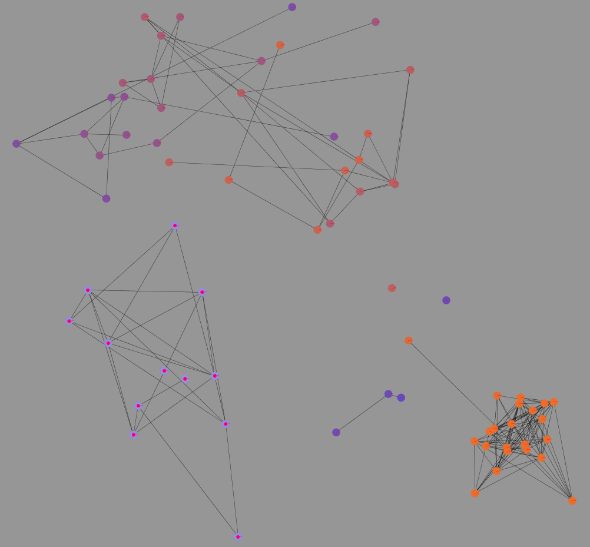
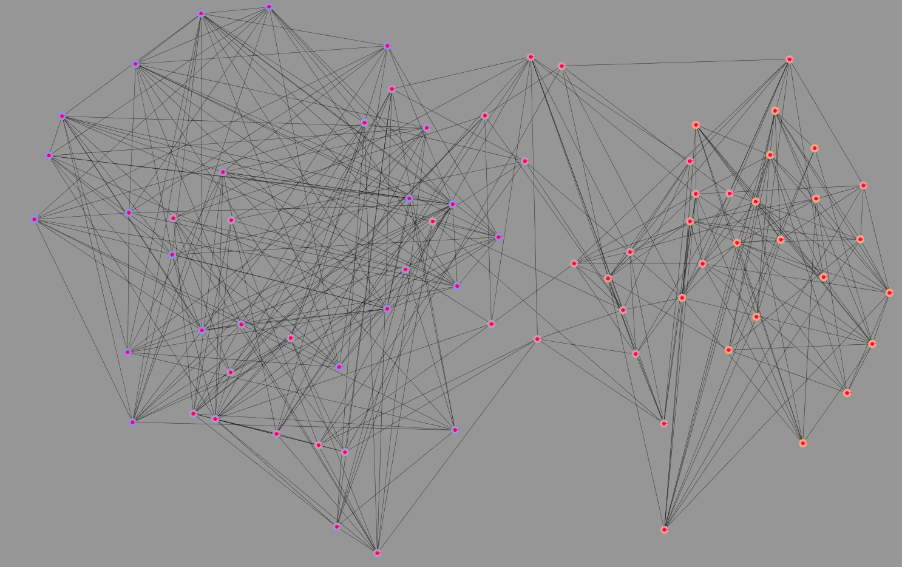
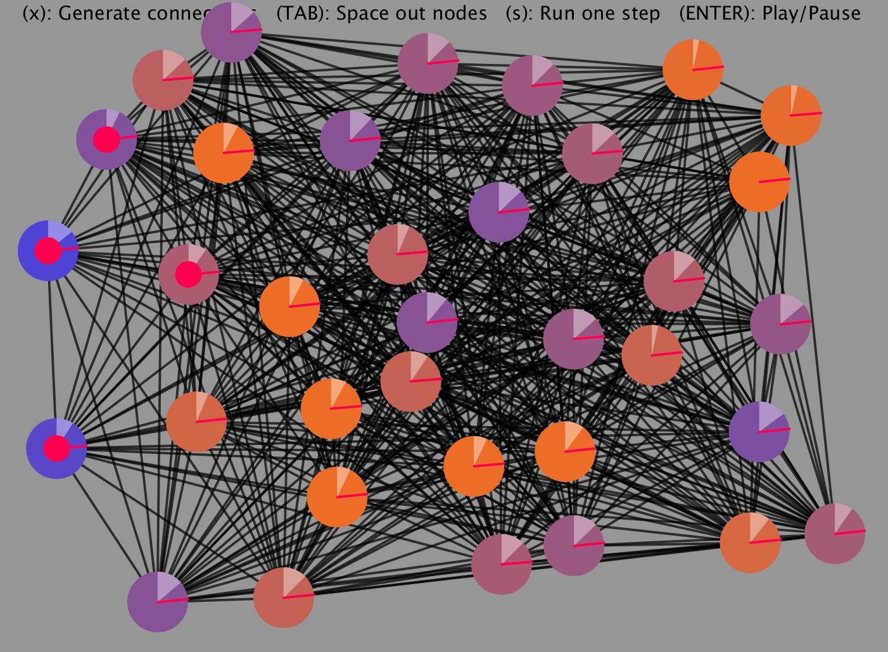

# RBA-coda

# Description

I present this program as my coda for PWR 1LF: Rhetoric of Disability.

My paper argues for adopting a policy of xenophilia and reciprocal care in order to establish equitable, non-normative societies. 
I approach the issue from feminist, disability studies, and social network theory perspectives, in order to argue that reciprocal care leads to societies that preserve identities while promoting the spread of complex ideas including non-normativity.

To support this argument, I made a simulation tool which models social network formation and the spread of complex ideas, drawing on the existing models of "small-world" networks, and "complex contagions".
My model innovates on existing models by considering how networks form under varying levels of xenophilia.

## The Model

People are represented as nodes within a network, with the color of the node representing their identity. For simplicity's sake, I only considered identity in one aspect, i.e. people were identified on a spectrum from blue to orange.

In order to track the spread of ideas, I used existing models of complex social contagions, in which a person is either "infected" with an idea or not. Infected individuals are marked with a red dot in the center: one of the four people in the network above is infected.

In order for an idea to spread in a complex contagion model, people must see that the proportion of their friends who are infected with the idea is greater than some threshold value. This threshold is visually represented as a red line, while the proportion of infected friends is represented by a white overlay on each node. In the example above, the node on the left has 1 of 3 friends infected, the overlay covers 1/3 of the circle. Because this slice of the pie crosses beyond the threshold, if I were to run the simulation at this point, the left node would become infected on the next step.

## Observations

While I have not conducted systematic investigation by manipulating the parameters, some initial observations can be made that support the claims I made in my RBA.

First, when networks are formed by people with low xenophilia, frequently the result is highly disconnected networks where complex ideas get stuck in one community and cannot cross bridges to reach other communities.

When xenophilia reaches moderate values however, the result is a small-world network where bridges are present, but bridges allow for complex ideas to spread between communities.

When xenophilia is complete, i.e. people are as likely to make connections with people different from them as anyone else, the result is a network which is too highly connected for complex ideas to travel, in accordance with small-world network theory. This seems like an unrealistic situation unlikely to be found in real life, but offers an interesting thought experiment nonetheless.

# How To Run

First, download or clone the repository using the download button on github.
If you have Processing(https://processing.org/) installed on your device, you can open coda_2.pde in Processing, and press the play button.
On the other hand, I have created several executable versions available in the application-... folders. Executables are available for Linux and Windows; unfortunately there is no option for Mac OSX yet. 

# Limitations

Any model of a complex process such as human social networks is bound to be incomplete. With that said, several limitations are present in my model which may limit its relevance to the real world:

- Does not take space into account
- Assumes that the threshold for an idea to infect is the same for everyone
- Assumes that everyone has the same shared level of xenophilia

These limitations may be undermine the possibility of drawing generalizable conclusions, and may be addressed in future work. However, this model represents a first step to thinking about community formation in a context of diversity and seeking non-normative structures of society.

# Acknowledgements

Thanks to Dr. Lindsey Felt for an inspiring and eye-opening class!
